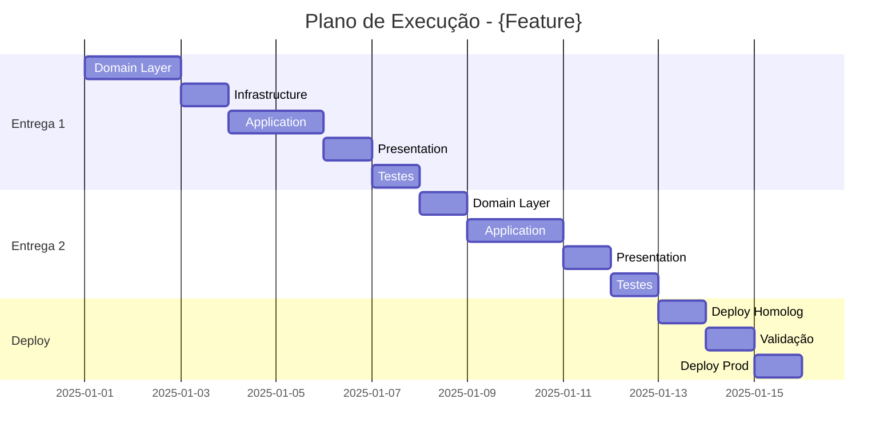

# Plan Structure

## Estrutura do Documento

O plano de execução deve ser salvo em:
```
docs/
└── execution-plans/
    └── {feature-name}/
        ├── execution-plan.md      # Plano principal
        ├── release-1.md           # Detalhamento entrega 1 (opcional)
        ├── release-2.md           # Detalhamento entrega 2 (opcional)
        └── risks.md               # Análise de riscos (opcional)
```

---

## Template: execution-plan.md

```markdown
# Plano de Execução: {Nome da Feature}

## Metadados
| Campo | Valor |
|-------|-------|
| **Especificação** | `docs/specs/{feature}/spec-functional.md` |
| **Autor** | {nome} |
| **Data** | {YYYY-MM-DD} |
| **Status** | Rascunho / Aprovado / Em Execução / Concluído |
| **Versão** | 1.0 |

---

## Resumo Executivo

### Objetivo
{Descrição breve do que será implementado e o valor entregue}

### Escopo
**Incluído:**
- {item 1}
- {item 2}

**Não incluído:**
- {item 1}
- {item 2}

### Métricas de Sucesso
- {Critério mensurável 1}
- {Critério mensurável 2}

---

## Visão Geral das Entregas

| # | Entrega | Descrição | Estimativa | Dependência |
|---|---------|-----------|------------|-------------|
| 1 | {Nome} | {Breve descrição} | {X}d | - |
| 2 | {Nome} | {Breve descrição} | {X}d | Entrega 1 |
| 3 | {Nome} | {Breve descrição} | {X}d | Entrega 2 |

**Estimativa Total:** {X} dias
**Buffer (20%):** {Y} dias
**Total com Buffer:** {Z} dias

---

## Entrega 1: {Nome da Entrega}

### Objetivo
{O que esta entrega entrega de valor isoladamente}

### Pré-requisitos
- {Pré-requisito 1, se houver}
- {Pré-requisito 2, se houver}

### Tarefas

#### Domain Layer
| ID | Tarefa | Tipo | Skill | Est. | Responsável |
|----|--------|------|-------|------|-------------|
| 1.1 | Criar entidade `{Entity}` | Entity | `dotnet-domain-entity` | 2h | - |
| 1.2 | Criar Value Object `{VO}` | ValueObject | `dotnet-domain-entity` | 1h | - |
| 1.3 | Criar interface `I{Entity}Repository` | Interface | `dotnet-domain-entity` | 0.5h | - |

#### Infrastructure Layer
| ID | Tarefa | Tipo | Skill | Est. | Responsável |
|----|--------|------|-------|------|-------------|
| 1.4 | Criar `{Entity}Configuration` | EF Config | - | 1h | - |
| 1.5 | Criar `{Entity}Repository` | Repository | `dotnet-infrastructure-repository` | 2h | - |
| 1.6 | Criar migration | Migration | - | 0.5h | - |

#### Application Layer
| ID | Tarefa | Tipo | Skill | Est. | Responsável |
|----|--------|------|-------|------|-------------|
| 1.7 | Criar `{Entity}Dto` | DTO | `dotnet-application-feature` | 0.5h | - |
| 1.8 | Criar `Create{Entity}Command` + Handler | Command | `dotnet-application-feature` | 3h | - |
| 1.9 | Criar `Get{Entity}ByIdQuery` + Handler | Query | `dotnet-application-feature` | 2h | - |

#### Presentation Layer
| ID | Tarefa | Tipo | Skill | Est. | Responsável |
|----|--------|------|-------|------|-------------|
| 1.10 | Criar `{Entity}Controller` | Controller | `dotnet-endpoint-generator` | 2h | - |
| 1.11 | Criar validators de request | Validator | `dotnet-endpoint-generator` | 1h | - |

#### Testes
| ID | Tarefa | Tipo | Est. | Responsável |
|----|--------|------|------|-------------|
| 1.12 | Testes unitários Domain | Unit Test | 2h | - |
| 1.13 | Testes unitários Application | Unit Test | 3h | - |
| 1.14 | Testes de integração | Integration | 3h | - |

### Subtotal Entrega 1
| Categoria | Estimativa |
|-----------|------------|
| Desenvolvimento | {X}h |
| Testes | {Y}h |
| **Total** | **{Z}h** |

### Critérios de Aceite
- [ ] Endpoint POST /api/{entities} funcional
- [ ] Endpoint GET /api/{entities}/{id} funcional
- [ ] Testes com cobertura > 80%
- [ ] Code review aprovado

### Validação
```bash
# Comandos para validar a entrega
curl -X POST http://localhost:5000/api/{entities} -d '{...}'
curl -X GET http://localhost:5000/api/{entities}/{id}
dotnet test --filter "Category=Entrega1"
```

---

## Entrega 2: {Nome da Entrega}

{Repetir estrutura da Entrega 1}

---

## Entrega 3: {Nome da Entrega}

{Repetir estrutura da Entrega 1}

---

## Cronograma

```
Semana 1: Entrega 1
├── Dia 1-2: Domain + Infrastructure
├── Dia 3-4: Application
└── Dia 5: Presentation + Testes

Semana 2: Entrega 2
├── Dia 1-2: ...
└── ...

Semana 3: Entrega 3 + Deploy
├── Dia 1-3: Entrega 3
├── Dia 4: Deploy Homolog
└── Dia 5: Validação + Deploy Prod
```

### Diagrama de Gantt (Mermaid)



---

## Riscos e Mitigações

| Risco | Probabilidade | Impacto | Mitigação |
|-------|---------------|---------|-----------|
| {Descrição do risco} | Alta/Média/Baixa | Alto/Médio/Baixo | {Ação de mitigação} |
| Integração externa instável | Média | Alto | Circuit breaker + retry |
| Requisitos podem mudar | Média | Médio | Entregas incrementais |

---

## Dependências Externas

| Dependência | Responsável | Status | Data Necessária |
|-------------|-------------|--------|-----------------|
| API de Pagamento disponível | Time Financeiro | Pendente | Semana 2 |
| Ambiente de homolog | DevOps | OK | Semana 3 |

---

## Definição de Pronto (DoD)

Uma tarefa está "pronta" quando:
- [ ] Código implementado e funcionando
- [ ] Testes unitários escritos (cobertura > 80%)
- [ ] Testes de integração (quando aplicável)
- [ ] Code review aprovado
- [ ] Documentação atualizada (se necessário)
- [ ] Sem débitos técnicos novos

Uma entrega está "pronta" quando:
- [ ] Todas as tarefas concluídas
- [ ] Todos os critérios de aceite validados
- [ ] Deploy em homolog bem-sucedido
- [ ] Testes de regressão passando

---

## Histórico de Revisões

| Versão | Data | Autor | Descrição |
|--------|------|-------|-----------|
| 1.0 | {data} | {autor} | Versão inicial |
```

---

## Exemplo Preenchido

```markdown
# Plano de Execução: Gestão de Produtos

## Metadados
| Campo | Valor |
|-------|-------|
| **Especificação** | `docs/specs/products/spec-functional.md` |
| **Autor** | João Silva |
| **Data** | 2025-01-10 |
| **Status** | Aprovado |
| **Versão** | 1.0 |

---

## Resumo Executivo

### Objetivo
Implementar o módulo de gestão de produtos, permitindo CRUD completo, 
categorização, controle de estoque e busca avançada.

### Escopo
**Incluído:**
- CRUD de produtos
- Categorização de produtos
- Controle de estoque básico
- Busca e filtros

**Não incluído:**
- Precificação dinâmica
- Integração com ERP
- Gestão de fornecedores

---

## Visão Geral das Entregas

| # | Entrega | Descrição | Estimativa | Dependência |
|---|---------|-----------|------------|-------------|
| 1 | CRUD Básico | Create, Read, Update, Delete de produtos | 3d | - |
| 2 | Categorias | Categorização de produtos | 2d | Entrega 1 |
| 3 | Busca e Filtros | Listagem paginada com filtros | 2d | Entrega 1 |
| 4 | Estoque | Controle de entrada/saída | 2d | Entrega 1 |

**Estimativa Total:** 9 dias
**Buffer (20%):** 2 dias
**Total com Buffer:** 11 dias

---

## Entrega 1: CRUD Básico

### Objetivo
Permitir criação, leitura, atualização e exclusão de produtos.

### Tarefas

#### Domain Layer
| ID | Tarefa | Tipo | Skill | Est. |
|----|--------|------|-------|------|
| 1.1 | Criar Value Object `Money` | ValueObject | `dotnet-domain-entity` | 1h |
| 1.2 | Criar entidade `Product` | Entity | `dotnet-domain-entity` | 2h |
| 1.3 | Criar interface `IProductRepository` | Interface | `dotnet-domain-entity` | 0.5h |

#### Infrastructure Layer
| ID | Tarefa | Tipo | Skill | Est. |
|----|--------|------|-------|------|
| 1.4 | Criar `ProductConfiguration` | EF Config | - | 1h |
| 1.5 | Criar `ProductRepository` | Repository | `dotnet-infrastructure-repository` | 2h |
| 1.6 | Criar migration inicial | Migration | - | 0.5h |

#### Application Layer
| ID | Tarefa | Tipo | Skill | Est. |
|----|--------|------|-------|------|
| 1.7 | Criar `ProductDto` | DTO | `dotnet-application-feature` | 0.5h |
| 1.8 | Criar `CreateProductCommand` | Command | `dotnet-application-feature` | 2h |
| 1.9 | Criar `UpdateProductCommand` | Command | `dotnet-application-feature` | 2h |
| 1.10 | Criar `DeleteProductCommand` | Command | `dotnet-application-feature` | 1h |
| 1.11 | Criar `GetProductByIdQuery` | Query | `dotnet-application-feature` | 1.5h |

#### Presentation Layer
| ID | Tarefa | Tipo | Skill | Est. |
|----|--------|------|-------|------|
| 1.12 | Criar `ProductsController` | Controller | `dotnet-endpoint-generator` | 3h |
| 1.13 | Criar Request Validators | Validator | `dotnet-endpoint-generator` | 1h |

#### Testes
| ID | Tarefa | Tipo | Est. |
|----|--------|------|------|
| 1.14 | Testes unitários Domain | Unit Test | 2h |
| 1.15 | Testes unitários Handlers | Unit Test | 3h |
| 1.16 | Testes integração API | Integration | 2h |

### Subtotal Entrega 1: 24.5h (~3 dias)
```
